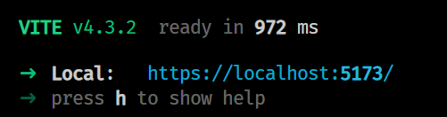

[](https://truevote.org)

[](https://twitter.com/TrueVoteOrg)
[](https://keybase.io/team/truevote)

[](https://github.com/TrueVote/TrueVote.App/actions/workflows/azure-static-web-app.yml)
[](https://github.com/TrueVote/TrueVote.App/actions/workflows/github-code-scanning/codeql)

# TrueVote.App

## 🌈 Overview

TrueVote.App is the primary frontend for [TrueVote](https://truevote.org).

The main technology stack platform is [React](https://react.dev) and the visual element framework is [Mantine](https://mantine.dev).

## 🛠 Prerequisites

* Setup and install the [TrueVote.Api](https://github.com/TrueVote/TrueVote.Api). Be sure and follow the '[proxy](https://github.com/TrueVote/TrueVote.Api#%EF%B8%8F-proxying-truevoteapi-locally)' step.
* Install [NodeJS](https://nodejs.org/) and [Yarn](https://yarnpkg.com/getting-started/install)

## ⌨️ Install, Build, and Serve the Site

Install all the front-end packages:

`$ yarn install`

Serve up the instance of the app locally, using [Vite](https://vitejs.dev/).

`$ yarn dev`



Vite expects the local TrueVote.Api to be listening on port 8080. See [vite.config.ts](vite.config.ts).

## 🎛️ Updating data models from the Api

TrueVote.App uses very strict static typing, and data models referenced are generated from the Api using the OpenApi standard. To update the data models from the latest Api, simply run the `refresh-api` command to the Production or Local instance of the Api. This will update the [TrueVote.Api.ts](src/TrueVote.Api.ts) file.

```bash
$ yarn refresh-api:prod
$ yarn refresh-api:local
```

## 🌐 Updating packages

TrueVote.App has external dependencies. Many of them are frequently updated for security and performance fixes and improvements. Sometimes there are regressions and our test suite is designed to catch them.

Run the updater:

`$ yarn update-packages`

`$ yarn install`

Test and ensure the app is working properly before committing and pushing.

## 🎁 Versioning

TrueVote.App uses [sementic versioning](https://semver.org/), starting with 1.0.0.

The patch (last segment of the 3 segments) is auto-incremented via a GitHub action when a pull request is merged to master. The GitHub action is configured in [.github/workflows/truevote-app-version.yml](.github/workflows/truevote-app-version.yml). To update the major or minor version, follow the instructions specified in the [bumping section of the action](https://github.com/anothrNick/github-tag-action#bumping) - use #major or #minor in the commit message to auto-increment the version.

## ❤️ Contributing

We welcome useful contributions. Please read our [contributing guidelines](CONTRIBUTING.md) before submitting a pull request.

## 📜 License

TrueVote.App is licensed under the MIT license.

[]((https://github.com/TrueVote/TrueVote.App/master/LICENSE))

[truevote.org](https://truevote.org)
<!---
Icons used from: https://emojipedia.org/
--->